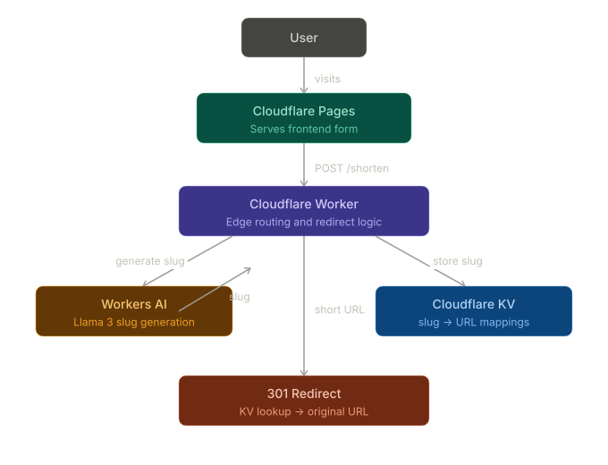

# AI Link Shortener

A globally distributed AI-powered link shortener built on Cloudflare's developer platform.

## Live Demo

[https://ai-link-shortener.pages.dev](https://ai-link-shortener.pages.dev)

## What It Does

Paste any long URL and get back a short, memorable, AI-generated link. Instead of random characters, the slug is generated by an AI model that reads the URL and describes the content.

**Example:**
- Input: `https://en.wikipedia.org/wiki/Transport_Layer_Security#Client-authenticated_TLS_handshake_and_certificate_request`
- Output: `https://link-shortener.ethannayak.workers.dev/tls-client-handshake`

The AI reads the URL and generates a slug that actually describes the content — not random characters. This works best with long, complex URLs like documentation pages, Wikipedia articles, or deeply nested web addresses where the original link is too long to share cleanly.

Note: The output domain is long because this project runs on a free Cloudflare subdomain (`workers.dev`) rather than a custom domain. In a production deployment with a short custom domain like `ethn.dev`, the full link would be `ethn.dev/tls-client-handshake`. The purpose of this project is to demonstrate the architecture and AI slug generation, not the domain length.

## Best Use Cases

This tool works best when your URLs are long, nested, or hard to remember:

- **Documentation links** — share deep links into docs like `/workers/runtime-apis/kv/#namespaces` as something readable like `kv-namespace-guide`
- **Wikipedia articles** — long Wikipedia URLs with section anchors become clean descriptive slugs
- **Marketing campaigns** — replace long tracking URLs in ads, tweets, or print materials with readable links
- **Content sharing** — share articles and blog posts with slugs that tell the reader what they're clicking before they click
- **A/B testing** — create multiple short links pointing to different landing pages and compare engagement using the built-in analytics dashboard
- **Link analytics** — track which links get the most clicks, when they were created, and manage them from the Stats page

This tool is less useful for already-short URLs where the slug ends up similar in length to the original.

## Architecture

## How It Works

1. User submits a URL via the frontend on Cloudflare Pages
2. Request hits a Cloudflare Worker at the edge — rate limited to 10 requests per minute per IP
3. Worker calls Workers AI (Llama 3) to generate a memorable slug based on the URL content
4. Slug and URL are stored in both Cloudflare KV (for fast redirects) and D1 (for analytics)
5. Short URL is returned to the user
6. When anyone visits the short URL, the Worker looks up the slug in KV and redirects instantly
7. Every redirect increments the click counter in D1
8. The Stats page queries D1 to show all links, click counts, and creation dates in real time

## Built With

- **Cloudflare Workers** — serverless edge functions handling all routing, redirect logic, and rate limiting across 330+ global locations
- **Cloudflare KV** — globally distributed key-value store for fast slug to URL lookups at the edge
- **Cloudflare D1** — SQLite database at the edge storing link metadata, creation timestamps, and click analytics
- **Cloudflare Workers AI** — Llama 3 model generates meaningful slugs from URLs
- **Cloudflare Pages** — hosts the frontend globally
- **JavaScript** — Worker and frontend logic

## Stack

- Cloudflare Workers
- Cloudflare KV
- Cloudflare D1
- Cloudflare Workers AI (Llama 3)
- Cloudflare Pages
- JavaScript